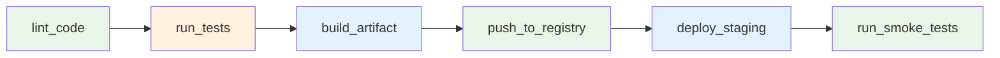

# CI/CD Pipeline Example

A 6-step CI/CD pipeline built with **workchain**, demonstrating sequential execution, async polling steps, retry policies, and typed configs/results.

## Pipeline Steps



| Step | Type | Notes |
|------|------|-------|
| `lint_code` | sync | Static analysis of source files |
| `run_tests` | sync | Test suite with retry (max 3 attempts) for flaky tests |
| `build_artifact` | **async** | Kicks off build, polls until complete (~3 polls) |
| `push_to_registry` | sync | Pushes built image to container registry |
| `deploy_staging` | **async** | Deploys to staging, polls for healthy rollout (~2 polls) |
| `run_smoke_tests` | sync | Smoke tests against the staging environment |

## Running the Example

```bash
pip install mongomock-motor
python -m examples.ci_cd_pipeline.example
```

## Key Features Demonstrated

- **Typed step configs and results** -- each step has its own `StepConfig` and `StepResult` subclasses with validated fields
- **Retry policy** -- `run_tests` retries up to 3 times with exponential backoff for transient failures
- **Async steps with PollHint** -- `build_artifact` and `deploy_staging` use completeness checks that return progress hints
- **Result passing** -- later steps access earlier results via the `results` dict (e.g., `push_to_registry` reads the `build_id` from `build_artifact`)
- **Long chain** -- 6 steps executing sequentially with mixed sync/async behavior
