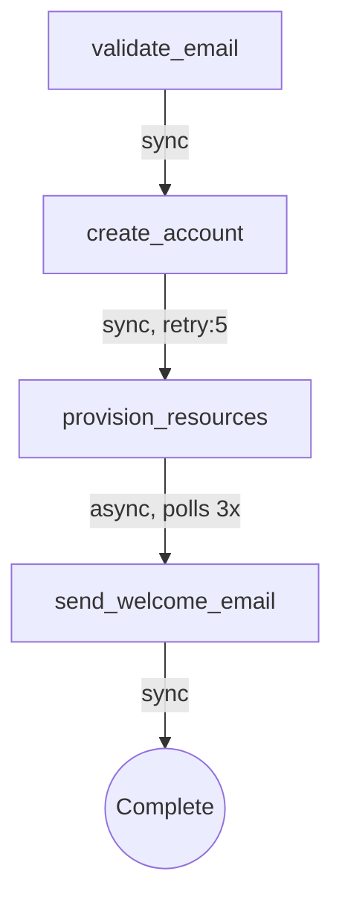

# Customer Onboarding

A complete workchain example that walks a new customer through validation,
account creation, resource provisioning, and a welcome email. It demonstrates
sync steps, retry with exponential backoff, async polling with progress
reporting, and typed config/result models.

## Flow



## Features Demonstrated

- **Typed StepConfig / StepResult** subclasses for compile-time safety
- **Sync steps** with immediate execution (`validate_email`, `send_welcome_email`)
- **Retry with backoff** on `create_account` (5 attempts, exponential)
- **Async polling** on `provision_resources` with `CheckResult` progress reporting
- **Result forwarding** between steps via `cast()` on the results dict
- **In-memory MongoDB mock** for zero-dependency local runs

## Run

```bash
python -m examples.customer_onboarding.example
```
