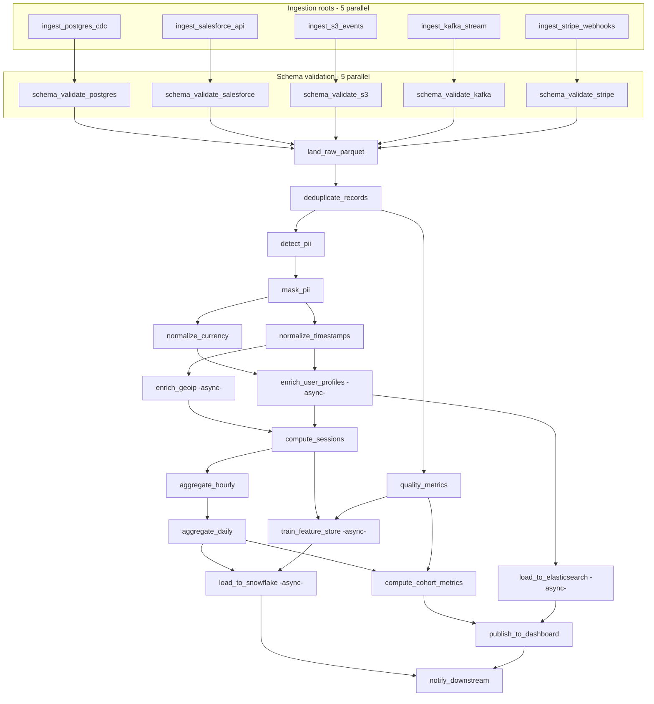

# Data Pipeline ETL Example

A **28-step** data-lakehouse workflow built with **workchain** that demonstrates
a realistic modern ETL / analytics pipeline: five parallel ingestion sources,
per-source schema validation, a fan-in landing zone, parallel PII / quality
branches, normalization, async enrichment, sessionization, aggregation,
feature-store training, and fan-out to multiple downstream sinks — exercising
every major primitive of the library in a single run.

## Workflow graph



## Steps at a glance

| # | Step | Type | Dependencies |
|---|------|------|--------------|
| 1 | `ingest_postgres_cdc` | sync | (root) |
| 2 | `ingest_salesforce_api` | sync | (root) |
| 3 | `ingest_s3_events` | sync | (root) |
| 4 | `ingest_kafka_stream` | sync | (root) |
| 5 | `ingest_stripe_webhooks` | sync | (root) |
| 6 | `schema_validate_postgres` | sync | `ingest_postgres_cdc` |
| 7 | `schema_validate_salesforce` | sync | `ingest_salesforce_api` |
| 8 | `schema_validate_s3` | sync | `ingest_s3_events` |
| 9 | `schema_validate_kafka` | sync | `ingest_kafka_stream` |
| 10 | `schema_validate_stripe` | sync | `ingest_stripe_webhooks` |
| 11 | `land_raw_parquet` | sync | all 5 schema validates (fan-in) |
| 12 | `deduplicate_records` | sync | `land_raw_parquet` |
| 13 | `detect_pii` | sync | `deduplicate_records` |
| 14 | `mask_pii` | sync | `detect_pii` |
| 15 | `quality_metrics` | sync | `deduplicate_records` |
| 16 | `normalize_currency` | sync | `mask_pii` |
| 17 | `normalize_timestamps` | sync | `mask_pii` |
| 18 | `enrich_geoip` | **async** | `normalize_timestamps` |
| 19 | `enrich_user_profiles` | **async** | `normalize_currency`, `normalize_timestamps` |
| 20 | `compute_sessions` | sync | `enrich_geoip`, `enrich_user_profiles` |
| 21 | `aggregate_hourly` | sync | `compute_sessions` |
| 22 | `aggregate_daily` | sync | `aggregate_hourly` |
| 23 | `compute_cohort_metrics` | sync | `aggregate_daily`, `quality_metrics` |
| 24 | `train_feature_store` | **async** | `compute_sessions`, `quality_metrics` |
| 25 | `load_to_snowflake` | **async** | `aggregate_daily`, `train_feature_store` |
| 26 | `load_to_elasticsearch` | **async** | `enrich_user_profiles` |
| 27 | `publish_to_dashboard` | sync | `compute_cohort_metrics`, `load_to_elasticsearch` |
| 28 | `notify_downstream` | sync | `load_to_snowflake`, `publish_to_dashboard` |

## Key patterns demonstrated

- **Fan-out / fan-in** — 5 parallel ingestion roots and 5 parallel schema
  validations converge at `land_raw_parquet`, which declares all 5 validation
  steps as dependencies. The engine runs all ingestions and validations
  concurrently across workers.
- **Independent branches** — quality metrics and PII detection run in parallel
  off `deduplicate_records`; currency and timestamp normalization run in
  parallel off `mask_pii`. The engine picks up each branch as soon as its
  dependencies resolve.
- **Five async polling steps** — `enrich_geoip`, `enrich_user_profiles`,
  `train_feature_store`, `load_to_snowflake`, and `load_to_elasticsearch`
  each submit an "external job" then poll a `@completeness_check` until done.
  Each uses a different `PollPolicy` (interval 2.0s, 2.5s, 3.0s, 2.5s, 2.0s)
  and a different expected poll count (3, 4, 5, 4, 3) to show the claim →
  submit → release → poll → complete cycle under varied cadences.
- **Decorator-driven metadata** — `retry_policy`, `poll_policy`, `depends_on`,
  `is_async`, and `completeness_check` are all declared on the handler
  decorators and auto-populated onto each `Step` at workflow construction.
  The workflow builder only supplies per-step config overrides.
- **Typed configs and results** — every handler uses `StepConfig` /
  `StepResult` subclasses; downstream handlers `cast()` result objects to
  access typed fields from their dependencies.
- **Realistic delays** — every handler sleeps for a uniform 5–20 seconds to
  simulate real work; completeness checks sleep 2–5 seconds per poll cycle.

## Running the demo

```bash
pip install mongomock-motor   # in-memory Mongo for local testing
python -m examples.data_pipeline_etl.example
```

Expected runtime is 5–10 minutes: wall-clock time is dominated by the
longest dependency chain (roughly ingest → validate → land → dedupe →
mask → normalize → enrich → sessions → hourly → daily → features →
snowflake → notify, plus polling cycles on the async steps).

## Running via the server / designer

The workflow is also registered as `"Data Pipeline ETL"` in the standalone
server's seeded templates (`workchain_server/example_templates.py`), so you
can launch it from the dashboard's Template Catalog or open it in the
designer. All 28 steps will appear with the correct dependency edges
auto-wired from the decorator `depends_on` declarations.
