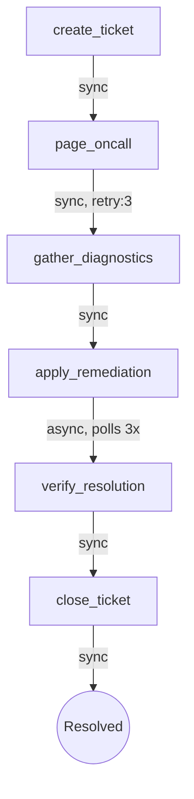

# Incident Response

A workchain example that models an ops incident lifecycle: ticket creation,
on-call paging, diagnostics collection, automated remediation with async
polling, post-fix verification, and ticket closure. It demonstrates a 6-step
chain with async remediation polling and typed config/result models.

## Flow



## Features Demonstrated

- **Typed StepConfig / StepResult** subclasses for compile-time safety
- **6-step sequential chain** modeling a full incident lifecycle
- **Sync steps** for ticket management, paging, diagnostics, and verification
- **Retry with backoff** on `page_oncall` (3 attempts, exponential)
- **Async polling** on `apply_remediation` with `PollHint` progress reporting
- **Result forwarding** between steps via `cast()` on the results dict
- **Conditional logic** in remediation (action depends on diagnostic metrics)
- **In-memory MongoDB mock** for zero-dependency local runs

## Run

```bash
python -m examples.incident_response.example
```
